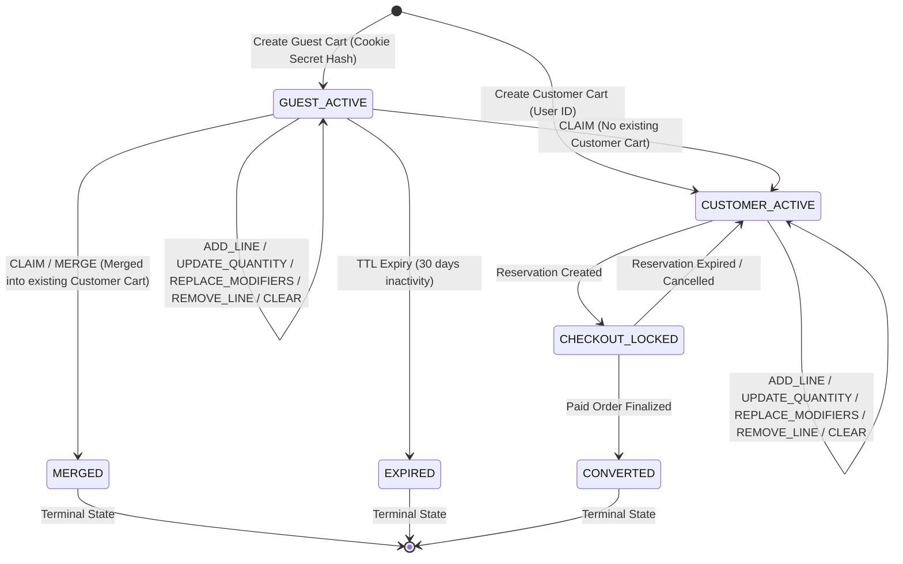
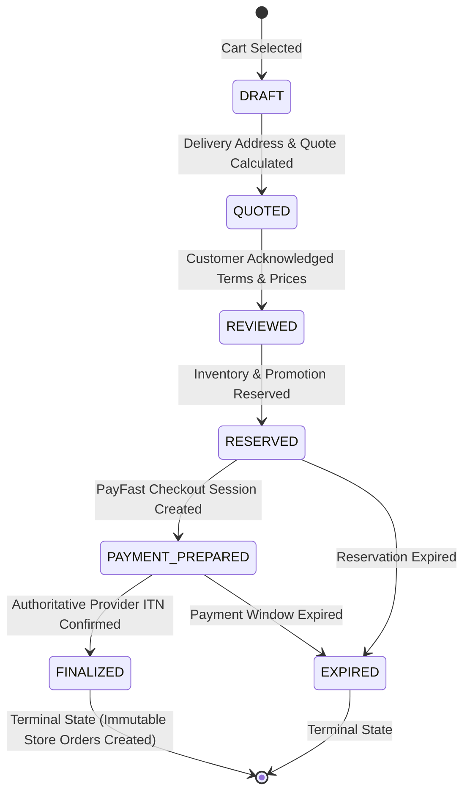

# 06 — Cart and Checkout State Machines

## Overview

This document specifies the formal state transitions, allowed mutations, terminal states, and invariant guards for the Marketplace Cart and Marketplace Checkout aggregates.

## Cart State Machine

### Cart Transitions

| Source State | Target State | Trigger Operation | Mutation Allowed? | Invariants Enforced |
| --- | --- | --- | --- | --- |
| `ACTIVE` (Guest/Customer) | `ACTIVE` | `ADD_LINE`, `UPDATE_QUANTITY`, `REPLACE_MODIFIERS`, `REMOVE_LINE`, `CLEAR` | Yes | Owner matching, max store limit (3), max line limit (50), quantity bounds (1-99), version increment |
| `GUEST_ACTIVE` | `CUSTOMER_ACTIVE` | `CLAIM` | Yes | Guest secret token hash verification, server-side line revalidation, owner updated to customer |
| `GUEST_ACTIVE` | `MERGED` | `CLAIM` / `MERGE` | No (Guest cart locked) | Atomic single-transaction merge, duplicate lines quantity capped at 99, receipt recorded as `MERGE` |
| `CUSTOMER_ACTIVE` | `CHECKOUT_LOCKED` | `RESERVATION` | No | Inventory reservation bound, cart locked against direct mutations during checkout review |
| `CHECKOUT_LOCKED` | `CUSTOMER_ACTIVE` | Expiry / Release | Yes | Unlocks cart when reservation expires or is abandoned |
| `CHECKOUT_LOCKED` | `CONVERTED` | Order Finalization | No (Terminal) | Marks cart converted upon verified payment confirmation |

## Checkout State Machine

### Checkout Transitions

| Source State | Target State | Operation | Invariants & Evidence |
| --- | --- | --- | --- |
| `DRAFT` | `QUOTED` | `DELIVERY_QUOTE` | Validates fulfillment address within courier coverage bounds |
| `QUOTED` | `REVIEWED` | `CHECKOUT_REVIEW` | Captures itemized subtotal, delivery fee, promotion discount, and customer acknowledgements |
| `REVIEWED` | `RESERVED` | `RESERVATION` | Holds inventory balances and promotion allocations; assigns reservation expiry timer |
| `RESERVED` | `PAYMENT_PREPARED` | `PAYMENT` | Generates deterministic PayFast payload & ITN callback signature |
| `PAYMENT_PREPARED` | `FINALIZED` | Verified Provider ITN | Verifies payment amount & signature; creates immutable `MarketplaceStoreOrder` records |
| Any non-finalized | `EXPIRED` | Timeout / Cancellation | Releases reserved inventory and promotion allocations |
