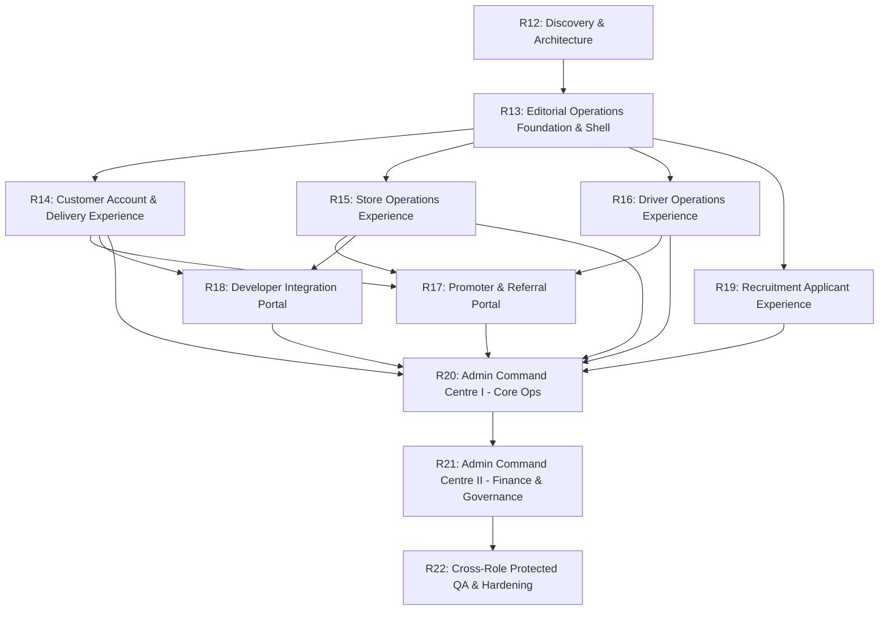

# KT Couriers Phase R12 — Protected Application Master Roadmap & Implementation Plan

> **Audit Context**: Multi-Phase Protected Application Rebuild Plan  
> **Sequence**: Phases R13 through R22  
> **Status**: APPROVED ARCHITECTURE ROADMAP

---

## 1. Multi-Phase Implementation Sequencing (R13 – R22)

---

## 2. Phase-by-Phase Execution Plan

### Phase R13: Protected Shell & Editorial Operations Foundation
- **Primary Goal**: Establish `components/layout/EditorialShell`, theme tokens (`app/globals.css`), role-aware navigation builders, mobile bottom navigation, and shared table/card primitives.
- **Key Components**: `EditorialShell`, `NavRail`, `MobileBottomBar`, `PageHeader`, `MetricTile`, `DataTable`, `EmptyState`, `StatusBadge`.
- **Target Routes**: All protected layouts (`app/(account)/layout.tsx`, `app/(store)/layout.tsx`, `app/(driver)/layout.tsx`, `app/(admin)/layout.tsx`).
- **Prerequisites**: R12 Approval.

### Phase R14: Customer Account & Delivery Experience
- **Primary Goal**: Rebuild retail and business customer workspace.
- **Target Routes**: `/account`, `/account/orders`, `/account/orders/[id]`, `/account/request-delivery`, `/account/wallet`, `/account/addresses`, `/account/profile`, `/account/security`.
- **Key Features**: Delivery request wizard with address map, order tracking timeline, double-entry wallet history, recipient book.

### Phase R15: Store Operations Experience
- **Primary Goal**: Rebuild merchant order fulfillment and catalog workspace.
- **Target Routes**: `/store`, `/store/orders`, `/store/orders/[id]`, `/store/catalog/products`, `/store/catalog/inventory`, `/store/earnings`, `/store/profile`.
- **Key Features**: Live order queue, item checklist, inventory stock table, payout ledger summary, store hours configuration.

### Phase R16: Driver Operations Experience (Mobile-First)
- **Primary Goal**: Rebuild driver dispatch, active delivery, and earnings console.
- **Target Routes**: `/driver`, `/driver/assignments`, `/driver/assignments/[id]`, `/driver/delivery`, `/driver/availability`, `/driver/earnings`.
- **Key Features**: Mobile-first touch interface, offer acceptance cards, turn-by-turn map frame, OTP entry, proof-of-delivery camera upload.

### Phase R17: Promoter & Referral Portal
- **Primary Goal**: Rebuild affiliate performance and commission workspace.
- **Target Routes**: `/promoter`, `/promoter/links`, `/promoter/referrals`, `/promoter/earnings`, `/promoter/wallet`, `/promoter/withdrawals`.
- **Key Features**: Link builder, conversion table, holding period tracker, withdrawal request form.

### Phase R18: Developer Integration Portal
- **Primary Goal**: Technical field-manual style API credential and webhook portal.
- **Target Routes**: `/developers/[[...segments]]`.
- **Key Features**: Display-once API key generator, webhook endpoint verification, delivery attempt log, OpenAPI schema viewer.

### Phase R19: Recruitment Applicant Experience
- **Primary Goal**: Responsive candidate portal for job applications and onboarding.
- **Target Routes**: `/applicant`, `/applicant/applications`, `/applicant/applications/new/[openingReference]`, `/applicant/applications/[reference]/*`.
- **Key Features**: Candidate wizard, document upload checklist, background check consent form, interview scheduler, digital offer acceptance.

### Phase R20: Administrator Command Centre I — Core Operations
- **Primary Goal**: Rebuild admin operational triage, master orders, dispatch, and entity directories.
- **Target Routes**: `/admin`, `/admin/orders`, `/admin/dispatch`, `/admin/pickup-exceptions`, `/admin/customers`, `/admin/stores`, `/admin/drivers`, `/admin/regions`, `/admin/pricing`.
- **Key Features**: Operational triage queue, live dispatch matrix, driver region map, pricing tariff manager.

### Phase R21: Administrator Command Centre II — Finance, Governance & Systems
- **Primary Goal**: Rebuild admin ledger, double-control finance workflows, recruitment desk, and system monitoring.
- **Target Routes**: `/admin/finance`, `/admin/ledger`, `/admin/payments`, `/admin/withdrawals`, `/admin/refunds`, `/admin/commissions`, `/admin/recruitment/*`, `/admin/notifications/*`, `/admin/permissions`.
- **Key Features**: Dual-control withdrawal approval, refund reconciliation desk, double-entry ledger explorer, granular permission editor.

### Phase R22: Cross-Role Protected QA & Hardening
- **Primary Goal**: End-to-end integration verification across all 6 roles, accessibility compliance validation, and production-lock readiness verification.
- **Target Routes**: Entire protected application surface (118 routes).

---

## 3. R13 Implementation-Readiness Brief

### 3.1 Files to Be Created / Modified in R13
- **New Layout Files**: `components/layout/EditorialShell.tsx`, `components/layout/EditorialNavRail.tsx`, `components/layout/EditorialTopbar.tsx`, `components/layout/EditorialMobileNav.tsx`.
- **New UI Foundation Files**: `components/ui/EditorialCard.tsx`, `components/ui/EditorialTable.tsx`, `components/ui/EditorialMetricTile.tsx`, `components/ui/EditorialStatusBadge.tsx`.
- **Modified Layouts**: `app/(account)/account/layout.tsx`, `app/(store)/store/layout.tsx`, `app/(driver)/driver/layout.tsx`, `app/(admin)/admin/layout.tsx`.
- **Styles**: Append tokens to `app/globals.css` without modifying public site classes.

### 3.2 Non-Negotiable R13 Migration Principles
- **No-Big-Bang Rule**: Existing pages remain functional during shell adoption.
- **Server Component First**: Shell layout must remain a Server Component; client interactivity is isolated to navigation handlers.
- **Strict Role Scoping**: Shell must enforce `requireRole()` and dynamic navigation filtering.
