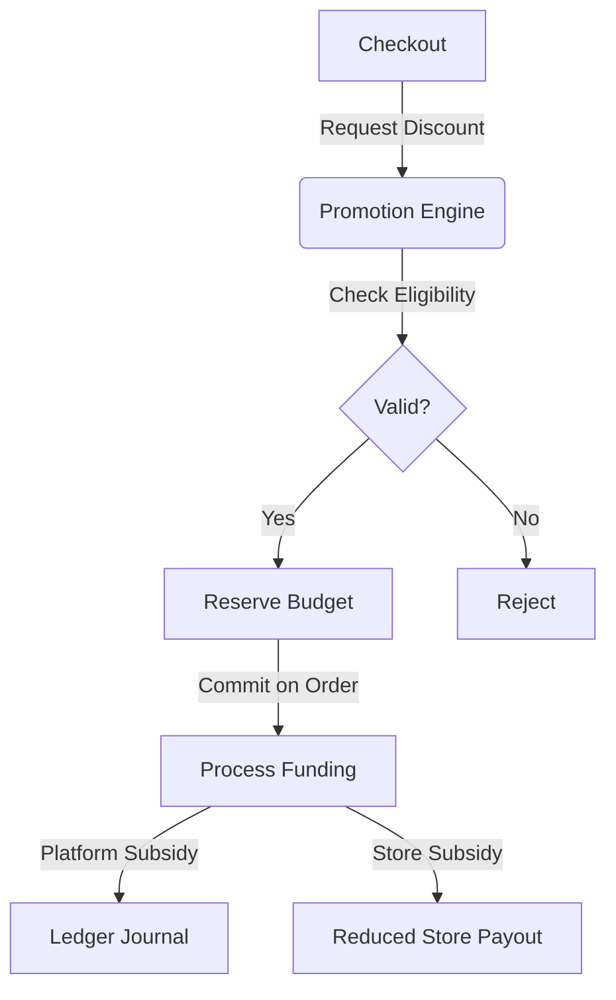

# Phase 23: Promotions and Coupons Research Map

## Audit of Existing Systems
- **Phase 6/14/15/16/20/21/22 Integration**: Promotions must stack with subscriptions and cleanly integrate with existing checkout.
- **Data Model**: `PromotionCampaign`, `PromotionCode`, `PromotionBudget`, `PromotionRedemption`. 
- **Financial Flow**: Uses double-entry ledger. All monetary amounts are `Decimal(18, 2)` (ZAR). Platform subsidies must record journal intents. Receipts are tracked via `operationId` + `requestHash`.

## Schema Design Rationale
Campaigns encapsulate targeting, eligibility, and rules. They hold multiple codes and share a single budget to prevent overselling.

## Financial Flow Diagram

## Integration Point Mapping
1. Checkout API evaluates applicable codes.
2. Order completion API commits reserved budgets.
3. Cancellation/Refund API restores budgets and releases funds.

## Legacy Promotion Compatibility Audit

This migration is described as: **unapplied non-destructive compatibility migration**

### Renamed Objects

| Old Database Name | New Legacy Database Name | Retained Prisma Model | Physical Mapping | Row Preservation | FK Preservation | Index Preservation | Remaining Readers | Remaining Writers | Fail-Closed Migration Conditions |
|---|---|---|---|---|---|---|---|---|---|
| `PromotionStatus` (enum) | `LegacyPromotionStatus` | `LegacyPromotionStatus` | ALTER TYPE RENAME | All rows preserved | N/A (enum) | N/A | Legacy admin UI (read-only) | None (Phase 23 uses new enums) | Enum must exist before migration runs |
| `DiscountType` (enum) | `LegacyDiscountType` | `LegacyDiscountType` | ALTER TYPE RENAME | All rows preserved | N/A (enum) | N/A | Legacy admin UI (read-only) | None | Enum must exist before migration runs |
| `Promotion` (table) | `LegacyPromotion` | `LegacyPromotion` | ALTER TABLE RENAME | All rows preserved | Updated to new table name | Renamed with table | Legacy admin UI (read-only) | None (Phase 23 uses PromotionCampaign) | Table must exist, no active writes |
| `Coupon` (table) | `LegacyCoupon` | `LegacyCoupon` | ALTER TABLE RENAME | All rows preserved | Updated to new table name | Renamed with table | Legacy admin UI (read-only) | None (Phase 23 uses PromotionCode) | Table must exist, no active writes |
| `PromotionRedemption` (table) | `LegacyPromotionRedemption` | `LegacyPromotionRedemption` | ALTER TABLE RENAME | All rows preserved | Updated to new table name | Renamed with table | Legacy admin UI (read-only) | None (Phase 23 uses PromotionRedemption) | Table must exist, no active writes |

### Source Audit

An executable source audit (`tests/policy/promotion-legacy-writer-audit.test.ts`) proves that no active Phase 23 runtime writer in `lib/promotions/` targets the obsolete legacy models (`LegacyPromotion`, `LegacyCoupon`, `LegacyPromotionRedemption`).

### Migration Status

The migration at `prisma/migrations/20260717150000_phase23_promotions_coupons/migration.sql` is an **unapplied non-destructive compatibility migration**. No Phase 22 or earlier migration has been changed.
